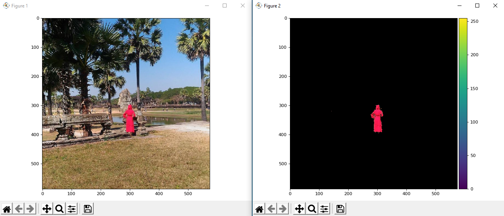

## COLOR ISOLATION


In this project, we seperated the objects that belonging to the color we want in the picture.

 When we do this, we use the HSV color space.





Finally, We were able to successfully isolate the red lady by using the HSV channel.

It requires each image to be treated differently. If we were dealing with hundreds of images this methodology would not be feasible.


We see that problems that seem complex at first, such as telling the machine to isolate specific colors, can be handled relatively easily. We learned the importance of not limiting yourself to dealing solely with the RGB color space. Knowledge of the HSV color space is extremely helpful when tackling problems that require color identification. In future we shall learn how to create scripts to identify similar colors and group them together, but for now I hope that you were able to get an idea of the many possibilities of image segmentation.


Cited from [towardsdatascience](https://towardsdatascience.com).


### Requirements

````
Python 3.x.x
-------------------------
NumPy
OpenCV
Matplotlib
skimage
````


### Authors

Emirhan KIRAN - [Emirhan KIRAN](https://www.linkedin.com/in/emir-kiran/)